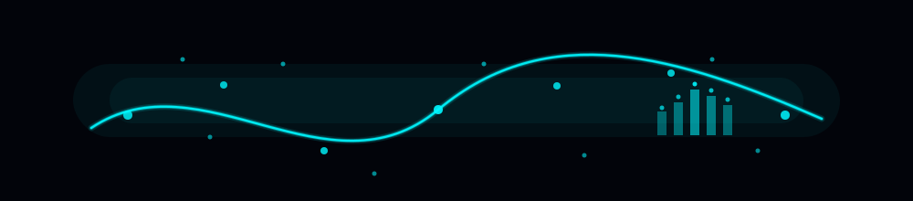

<!-- 🌌 Fnu Gaurav – Fully Creative Neon GitHub Profile README -->

<!-- ==== TOP BANNER ==== -->

  

<!-- ==== NAME & TAGLINE ==== -->
<h1 align="center">🧠 Fnu Gaurav</h1>
<h3 align="center">Clinical AI · Uncertainty · Explainability · Backend & DevOps</h3>

<!-- ==== TYPING NEON SUBTITLE ==== -->

  

<!-- ==== NAV BADGES ==== -->

  
  
  

  ✨━━━━━━━━━━━━━━━━━━━━🌌━━━━━━━━━━━━━━━━━━━━✨

<!-- ==== ABOUT ME ==== -->
## 🌌 Who Am I?

> *“Some people deploy models. I deploy calibrated, explainable, monitored systems.”*

I’m a **Machine Learning Engineer + Backend Developer** who lives at the intersection of:

- 🧠 **Clinical risk models** — calibration, uncertainty, SHAP, bootstrap CIs  
- ⚙️ **Production ML systems** — FastAPI · Docker · GCP Cloud Run · MLflow  
- 🏗️ **Backend architecture** — PostgreSQL · Redis · JWT · CI/CD · Kubernetes  
- 📊 **Human–AI interaction** — dashboards for decision support  
- 🔍 **Research interests:** uncertainty communication · explainable AI · human–AI collaboration  

I turn **research-flavored ideas** into **production-grade systems**: APIs, dashboards, metrics, pipelines, and monitoring.

  ✨━━━━━━━━━━━━━━━━━━━━🌌━━━━━━━━━━━━━━━━━━━━✨

<!-- ==== TECH STACK ==== -->
## 🎛 Tech Stack · Visual Mode

### 🧮 Languages  

### 🤖 ML / AI Tools  
`scikit-learn` · `PyTorch` · `Transformers (HF)` · `XGBoost` · `SHAP` · `MLflow`

### 🏗 Backend & APIs  

### 🗄 Databases  

### ⚙️ DevOps & Cloud  

  ✨━━━━━━━━━━━━━━━━━━━━🌌━━━━━━━━━━━━━━━━━━━━✨

<!-- ==== FEATURED PROJECTS ==== -->
<h2 align="center">🌟 Featured Projects</h2>

<i>A curated selection of my strongest engineering, ML, and uncertainty visualization work.</i>

---

<!-- ==== CLINICAL AI PROJECTS ==== -->
<h2 align="center">🩺 Clinical AI · Uncertainty · Explainability</h2>

<!-- HDI Uncertainty Dashboard -->
### 🔹 **HDI Uncertainty Dashboard**
Full clinical risk prediction pipeline with calibration, bootstrap uncertainty, and SHAP — delivered through a Streamlit dashboard for trustworthy AI.

  
  
  
  
  

🔗 https://github.com/Dx2905/hdi-uncertainty-dashboard  

---

### 🔹 **Uncertainty Visualization Playground**
Interactive Streamlit playground demonstrating uncertainty visualization techniques for clinical risk prediction models.

  
  
  
  

🔗 https://github.com/Dx2905/uncertainty-viz-playground  

---

### 🔹 **Clinical Uncertainty Design Space**
Mini-paper + prototype suite exploring a design space of uncertainty and explainability views for clinical AI dashboards.

  
  
  
  

🔗 https://github.com/Dx2905/clinical-uncertainty-design-space  

  ✨━━━━━━━━━━━━━━━━━━━━🌌━━━━━━━━━━━━━━━━━━━━✨

<!-- ==== ML PIPELINES ==== -->
<h2 align="center">🤖 Machine Learning Pipelines & AI Systems</h2>

### 🔹 **Breast Cancer ML Pipeline**
End-to-end ML pipeline with SHAP explainability, MLflow tracking, FastAPI inference, Docker deployment, Prometheus monitoring, and Airflow retraining.

  
  
  
  
  
  

🔗 https://github.com/Dx2905/breast-cancer-ml-pipeline  

---

### 🔹 **Falcon9 Landing Prediction Pipeline**
ML pipeline predicting Falcon 9 landing success using scraped/API data. Deployed using FastAPI + Docker on GCP Cloud Run.

  
  
  
  

🔗 https://github.com/Dx2905/falcon9-landing-prediction-pipeline  

---

### 🔹 **Toxic Content Detection System**
Transformer-based toxicity detection (RoBERTa/BART) + CNN pipeline. Real-time/batch inference with FastAPI + Docker.

  
  
  
  

🔗 https://github.com/Dx2905/toxic-content-detection-system  

---

### 🔹 **Bloom’s Taxonomy NLP Classifier**
Educational question classification using TF-IDF + SVM/RF with SHAP explainability, Streamlit UI, FastAPI backend, and DVC versioning.

  
  
  
  
  

🔗 https://github.com/Dx2905/blooms-taxonomy-nlp-classifier  

---

### 🔹 **Zero-Shot LLM Text Operations**
GPT-based Streamlit toolkit for summarization, translation, sentiment analysis, and Q&A through dynamic zero-shot prompting.

  
  
  

🔗 https://github.com/Dx2905/zero-shot-llm-text-operations  

  ✨━━━━━━━━━━━━━━━━━━━━🌌━━━━━━━━━━━━━━━━━━━━✨

<!-- ==== BACKEND / MICROSERVICES ==== -->
<h2 align="center">🧱 Backend Engineering · Microservices · DevOps</h2>

### 🔹 **Microservices K8s DevOps Playground**
Simulated AWS EKS microservices stack using Kubernetes (kind), Docker, Spring Boot, Node.js, Prometheus, Grafana, Ingress, and HPA.

  
  
  
  
  

🔗 https://github.com/Dx2905/microservices-k8s-devops-playground  

---

### 🔹 **Task Manager Backend Service**
FastAPI backend with PostgreSQL, Redis caching, JWT auth, Docker packaging, and Prometheus metrics.

  
  
  
  
  

🔗 https://github.com/Dx2905/task-manager-backend-service  

---

### 🔹 **Notification Event Service**
Event logging & notification simulation backend built with Express, Redis, Docker, JWT auth, and a Jest test suite.

  
  
  
  
  

🔗 https://github.com/Dx2905/notification-event-service  

---

### 🔹 **Contact Book Backend**
Spring Boot REST API with PostgreSQL, JWT authentication, and full CRUD operations for contact management.

  
  
  
  

🔗 https://github.com/Dx2905/contact-book-backend  

---

### 🔹 **Job Tracker SaaS Platform**
Full-stack SaaS job tracking platform with FastAPI, PostgreSQL, SQLAlchemy, Next.js 14, TypeScript, JWT auth, and Docker.

  
  
  
  
  

🔗 https://github.com/Dx2905/job-tracker-saas-platform  

  ✨━━━━━━━━━━━━━━━━━━━━🌌━━━━━━━━━━━━━━━━━━━━✨

<!-- ==== FRONTEND ==== -->
<h2 align="center">🎨 Frontend / UI / Dashboards</h2>

### 🔹 **React Admin Dashboard**
Modern React admin dashboard with authentication, protected routes, REST API integration, Tailwind UI, and Vercel CI/CD.

  
  
  
  

🔗 https://github.com/Dx2905/react-admin-dashboard  

---

### 🔹 **Portfolio Website**
Personal website showcasing projects & experience — clean, minimal, and fast.

  
  
  

🔗 https://github.com/Dx2905/FnuGauravWeb  

---

  ✨━━━━━━━━━━━━━━━━━━━━🌌━━━━━━━━━━━━━━━━━━━━✨

<!-- ==== GITHUB STATS ==== -->
## 📊 GitHub At A Glance

  

  ✨━━━━━━━━━━━━━━━━━━━━🌌━━━━━━━━━━━━━━━━━━━━✨

<!-- ==== RADAR ==== -->
## 🔭 Current Radar

- 🩺 Better ways to **visualize uncertainty** for clinicians  
- 🧩 More interpretable, calibrated ML systems  
- ⚙️ Building observable ML APIs & microservices  
- 🎛 Dashboard design for human-AI collaboration  
- 🧪 End-to-end reproducible ML/DevOps workflows  

---

<!-- ==== CONTACT ==== -->
## 📬 Ping Me

If you're into **ML, XAI, uncertainty, dashboards, backend infra, or DevOps**,  
I'm always open to chat or collaborate.

- 📧 **Email:** `yadav.gaurav2905@gmail.com`  
- 🔗 **LinkedIn:** https://www.linkedin.com/in/fnu-gaurav-653355252/

✨ _Thanks for scrolling.  
May your logs be clean,  
your models calibrated,  
and your containers always healthy._ ✨

